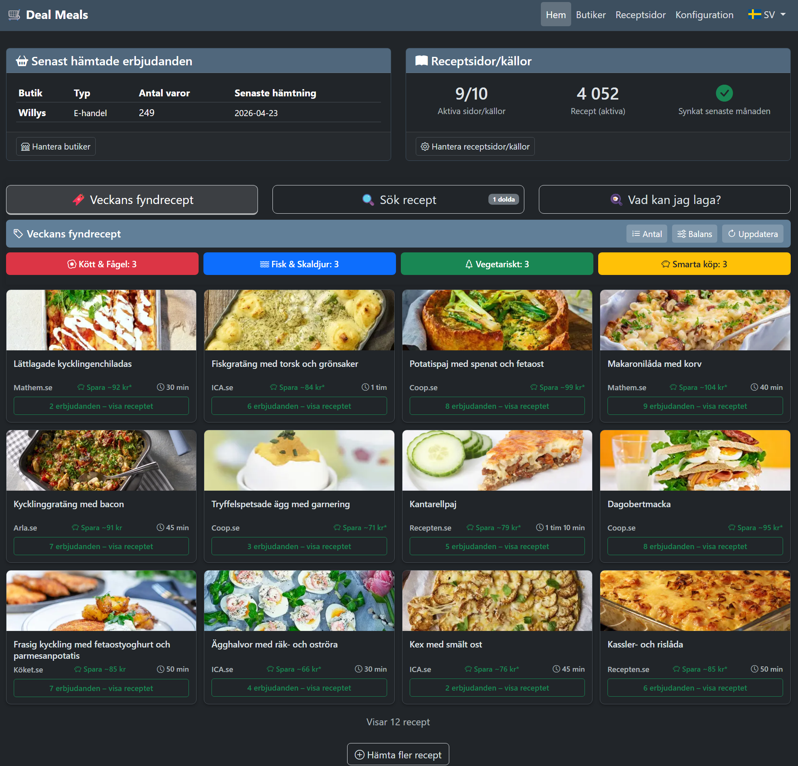
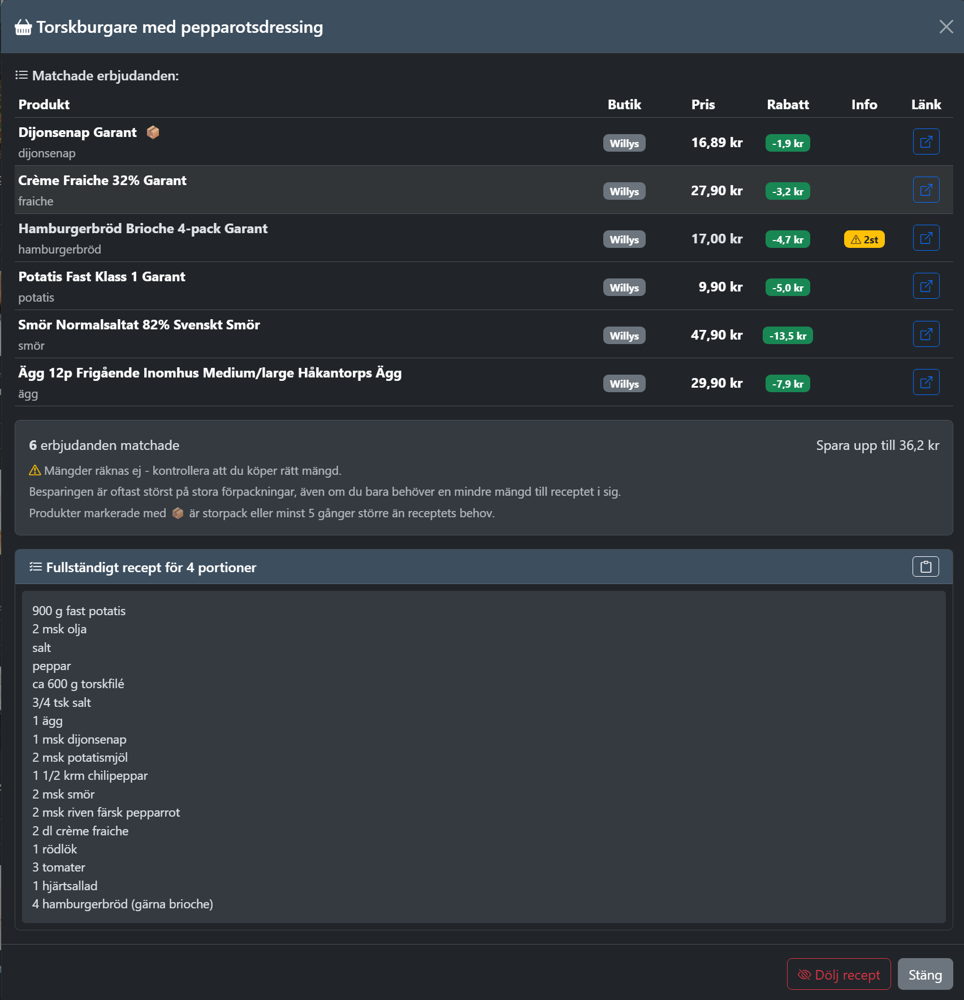
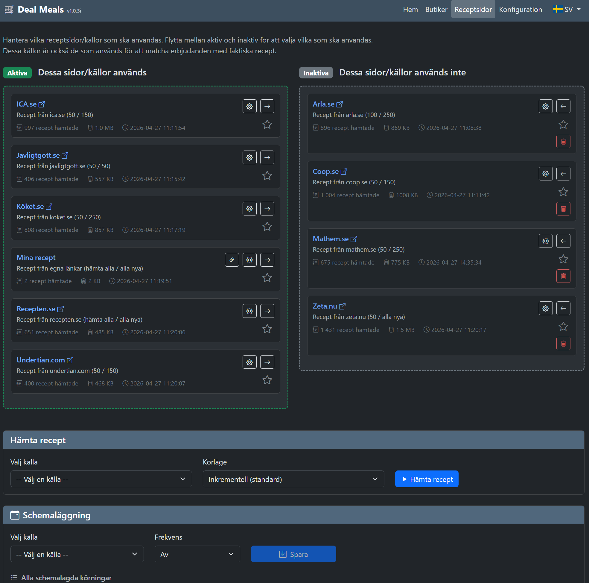
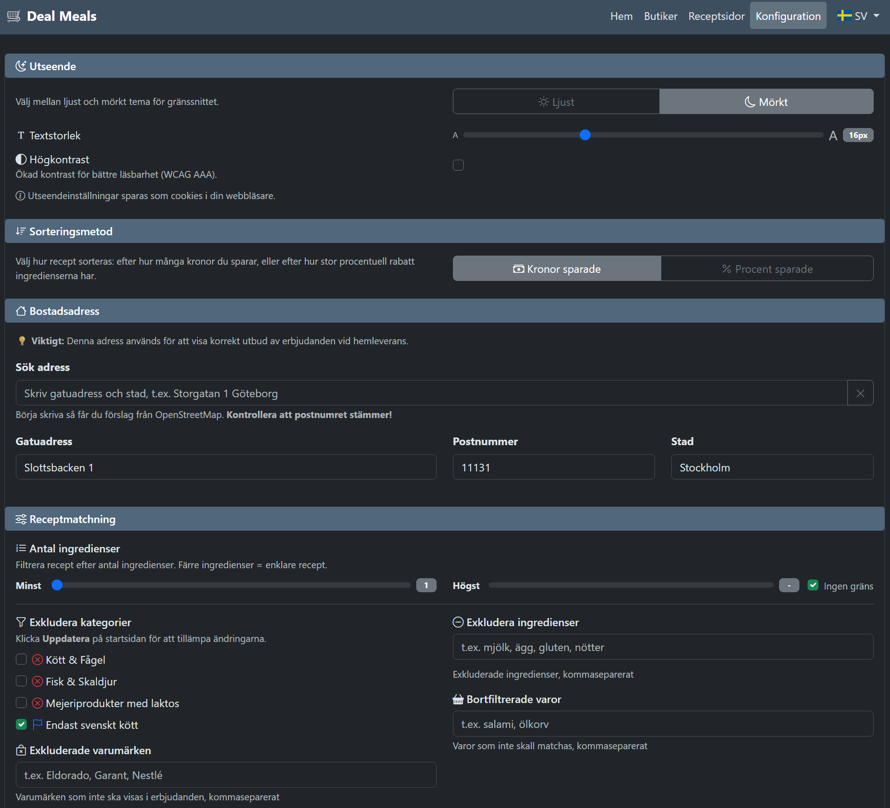

# Deal Meals

Swedish grocery deal aggregator with recipe suggestions.

## Project Status

Deal Meals is a personal hobby project. I built it to help me plan weekly meals and grocery shopping when inspiration runs dry, and at the same time save some money by making the most of the store's weekly specials.

It is useful to me, and I hope it may be useful to others too, but expectations
should be adjusted accordingly. This is not a commercial product; it is a
best-effort personal project.

There will probably be bugs. Store and recipe scrapers are especially fragile by
nature, because they depend on websites and APIs I do not control. Some of them
will likely break over time when those sites change. I will try to fix issues
when I can, but maintenance is best-effort.


**Built with AI.** The code is written by [Claude](https://claude.ai) and [Codex](https://openai.com/codex/). 
The design, logic, product decisions, and direction are mine — I describe what I want, review the results, and decide what stays. I have technically written 4 or 5 lines of code, but the rest of it was done by AI.


**How it works:** Choose the store you do your weekly shopping at. The app fetches their current offers and matches them against thousands of recipes. The result is a personalized list of meal suggestions based on what's actually on sale this week — organized by category (meat, fish, vegetarian, smart buys) and ranked by how much you save.

> **Swedish stores and recipes only.** The scrapers, ingredient matching engine, and recipe sources are all built specifically for Sweden — Swedish grocery chains (Willys, ICA, Coop) and Swedish-language recipe sites. There is UK English UI/address support and a loadable UK matcher scaffold, but not a finished UK grocery/recipe implementation. Adding support for stores or recipe sites in other countries is possible and even encouraged, but requires writing new scrapers and adapting the matching logic to the local language & country. It's doable, but it's a significant amount of work.


## Screenshots


*Weekly deals matched against recipes — sorted by savings*


*Matched products and savings breakdown*


*Recipe source management and scraping*


*Settings and dietary preferences*

## Features

- Scrapes deals from **Willys**, **ICA**, **Hemköp**, **Mathem** and **Coop** (physical stores and online)
- 10+ recipe sources (Coop.se, ICA.se, Köket.se, Arla.se, Mathem.se, and more)
- Intelligent ingredient-to-product matching with Swedish language support
- Powered by **FIKA**: the Fast Inverted Keyword Architecture for matching recipes against weekly deals
- Four recipe categories: Meat & Poultry, Fish & Seafood, Vegetarian, Smart Buys
- Budget scoring based on savings, coverage and number of matching products
- Filter by dietary preferences (exclude meat, fish, dairy, or specific ingredients)
- Recipe images, direct links to source, and matched product details
- Starred recipes and personal favorites
- HTTPS support via certificate upload in Settings, or mounted certificates in `certs/`
- Runs in Docker with no local runtime dependencies beyond Docker/Compose
- UI defaults to Swedish — switch to English (United Kingdom) via the language menu in the top navigation

## Matching Quality

Deal Meals is not magic, and it does not try to pretend that recipe matching can
be perfect. The Swedish matcher aims for roughly **95-97% useful matches** for
recipe ingredients that can reasonably be mapped to real grocery products.

100% is not realistic in practice: stores rename products, recipes use vague
ingredient wording, and some ingredients simply do not have a clean equivalent
among this week's offers. The goal is practical usefulness: good enough to help
you find real meal ideas from current deals, while keeping misleading matches
as low as possible.

Some everyday product families are intentionally matched pragmatically. Pasta
families such as regular pasta and long pasta, rice, cheese, halloumi/grill
cheese, plain chicken fillet variants and mince variants may be grouped where
recipes are usually flexible, so a useful discounted alternative is not hidden
just because the store and recipe use slightly different wording.

For best results, download several thousand recipes from multiple sources. A
small recipe database can still be useful for search, but with only a few
hundred recipes the chance of finding a recipe with several strong current deals
is naturally much lower.

## FIKA Engine and Cache Warm-Up

Recipe suggestions are powered by **FIKA** - the Fast Inverted Keyword
Architecture. It is the matching and cache engine that turns scraped Swedish
recipes and weekly store offers into ranked meal suggestions.

In less caffeinated information-retrieval terms, FIKA does a few things before a
recipe ever reaches the home page:

- Compiles recipes and offers into normalized matcher payloads instead of
  repeatedly parsing raw scraped text.
- Builds term indexes for recipe and offer wording, so rebuilds can start from
  plausible recipe-offer candidates instead of comparing everything with
  everything.
- Stores versioned candidate rows in PostgreSQL, which lets small recipe or
  offer changes update the affected cache rows with a delta path.
- Runs the real ingredient/product matcher as the final gate, then scores the
  surviving matches by savings, coverage and usefulness.

The result is deliberately practical: the broad term-index stage is allowed to
be generous, but the final matcher is still responsible for rejecting misleading
ingredient matches before suggestions are shown.

There are two warm-up levels:

1. **Recommendation warm-up:** after recipes and store offers exist, Deal Meals
   needs one successful cache rebuild before the home page can show the full
   set of current suggestions.
2. **Fast-path warm-up:** the app verifies its faster incremental cache paths a
   few times before relying on them fully.

Until warm-up finishes, the app still works. It may show fewer suggestions, old
suggestions, or no suggestions before the first rebuild completes. Later, while
the faster paths are warming up, refreshes can simply be a little slower.
Scheduling recipe and store fetches lets these refreshes happen in the
background. See the user manual for the practical cache refresh behavior.

The incremental delta path is the normal day-to-day path, but full rebuilds can
still happen after first setup, larger imports, offer updates, matcher/version
changes or safety fallbacks. Full rebuilds may take several minutes and use
noticeable CPU and memory, especially on smaller servers. For normal use,
schedule recipe and store fetches overnight or at another quiet time so any
heavier rebuild runs while the app is not being actively used.

## Requirements

- Docker with Compose v2
- About 2 GB RAM for a normal install with the bundled container limits.
- 2 CPU cores recommended. A single-core host works, but large refreshes take
  longer and can make the web UI less responsive while they run.

The release compose file uses conservative container limits: 1536 MiB for the
web container and 512 MiB for PostgreSQL. As a practical sizing rule, budget
about 1 GiB of web-container memory per 10,000 active recipes. The bundled
1536 MiB web limit is therefore intended for roughly 15,000 active recipes with
the default Swedish data shape and cache settings. Very large recipe libraries
or custom worker settings may need more headroom, so measure on your own data
if you tune those settings.

Cache refreshes, full rebuilds and progress logging are covered in the user
manuals: [Swedish](docs/USER_MANUAL_SVENSKA.md#vad-händer-vid-cacheuppdateringar)
and [English](docs/USER_MANUAL_ENGLISH.md#what-happens-during-cache-refreshes).
For smaller hosts, scheduled overnight fetches are strongly recommended so full
rebuilds do not compete with interactive use.

## Network Security

Deal Meals has no built-in authentication. This is intentional: it is meant to be
a simple recipe and grocery planning app for a trusted local network, not a
public internet service.

Do not expose the app directly to the internet. If you need access from outside
your home network, put it behind a VPN or a reverse proxy with authentication
such as Nginx Proxy Manager, Traefik, or Caddy together with Authentik or a
similar identity provider.

The app still includes practical hardening such as origin checks, rate limits,
SSRF guards for outgoing requests, security headers, non-root containers and a
read-only production filesystem. See [Security](docs/SECURITY.md) for the full
overview.

## Quick Start (Production)

This is the recommended setup for normal use. It uses the standalone release
compose file and prebuilt Docker images.

```bash
mkdir deal-meals && cd deal-meals
wget -O docker-compose.yml https://github.com/ssavant2/deal-meals/releases/latest/download/docker-compose.yml
wget -O .env https://github.com/ssavant2/deal-meals/releases/latest/download/example.env

# Edit .env — set DB_PASSWORD and DB_APP_PASSWORD, also add server IP and/or DNS-name under 'Security'.
docker compose up -d
```

Open `http://[your server IP/DNS-name]:20080` and follow the start guide in the UI.

The UI defaults to Swedish. Switch to English (United Kingdom) via the language menu in the top navigation bar.

## Update

```bash
docker compose pull && docker compose up -d
```

If release notes mention changes to the standalone compose file, re-download
`docker-compose.yml` before updating.

## Development / Contributing

There is also a dedicated development setup for anyone who wants to explore the
code, build custom store or recipe scrapers, add support for a new language or
country, or just tinker without using the read-only production container setup.

The dev setup uses `docker-compose.dev.yml` as an overlay. It runs on separate
ports, bind-mounts the local `app/` folder into the container, uses separate dev
container names and database volume, and enables Adminer for database browsing.

Quick start:

```bash
git clone https://github.com/ssavant2/deal-meals.git
cd deal-meals
cp deploy/example-dev.env .env
# Edit .env — set DB_PASSWORD, DB_APP_PASSWORD and ALLOWED_HOSTS if needed.
mkdir -p app/logs app/static/recipe_images data certs
docker volume create deal-meals-dev_postgres_data
docker compose build --no-cache && docker compose up -d
```

Open the dev app at `http://localhost:20070`. Adminer is available at
`http://localhost:8071`.

See [INSTALL.md](INSTALL.md) for the full developer install, and
[HOW_TO_ADD_SCRAPERS.md](docs/HOW_TO_ADD_SCRAPERS.md) /
[HOW_TO_ADD_COUNTRIES.md](docs/HOW_TO_ADD_COUNTRIES.md) for extension guides.

## Documentation

- [Installation Guide](INSTALL.md) — detailed setup, developer install, reverse proxy, troubleshooting
- [Security](docs/SECURITY.md) — threat model and implemented hardening
- [Testing](docs/TESTING.md) — tracked app-support checks vs local workbench tests
- [Cache Fallback Runbook](docs/CACHE_FALLBACK_RUNBOOK.md) — diagnosing repeated cache-delta fallbacks
- [User Manual (Svenska)](docs/USER_MANUAL_SVENSKA.md) — full user guide in Swedish
- [User Manual (English)](docs/USER_MANUAL_ENGLISH.md) — full user guide in English

## License

Deal Meals is licensed under [AGPL-3.0](LICENSE).

You are free to use, modify, and redistribute this software under the terms of
the AGPL. If you run a modified version as a network service or distribute it,
you must make the corresponding source code available under the same license.

Commercial use, paid hosting, and paid support are permitted. Please do not
present unofficial forks or hosted versions as official Deal Meals releases.
